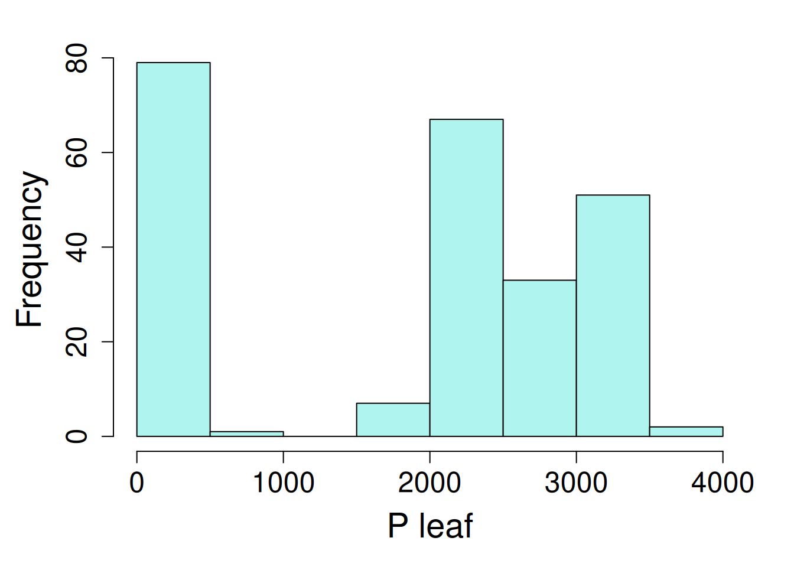

# Repeated measures mixed models


In the previous chapters we have covered how to run linear mixed models for different experiment designs. All of the examples in those chapters were independent measure designs, where each subject was assigned to a different treatment. Now we will move on to experiment with repeated measures effects (also called **"longtudinal data"**).

Studies that involve repeated observations of the exact same experimental units (or subjects) requires a repeated measures component in analysis to properly model correlations across time for each subject. This is common in studies that are evaluated across different time periods. For example, if samples are collected over the different time periods from same subject, we have to model the repeated measures effect while analyzing the main effects.

In these models, the 'iid' assumption (independently and identically distributed) is being violated often, so we need to introduce specialized covariance structures that can account for these correlations between error terms.

Fitting models with correlated observations requires new libraries including **mmrm** and **nlme**. The **lme4** package allows random effects only. In this chapter, we will analyze the data with repeated measures from different experiment designs including randomized complete block design, split plot, and split-split plot design.

There are several types of covariance structures:

| Structure name | nlme function | mmrm function | Assumption |
|------------------------|------------------------|------------------------|
| Autoregressive (AR1) | `corAR1()` | `ar1`  | observations which are more proximate are more correlated than measures that are more distant |
| Compound symmetry | `corCompSymm()` |   | Correlation is equal for all time gaps between observations |
| Unstructured | `CorSymm()` |    | Correlations are different for the various time gaps |

::: column-margin
To read more about selecting appropriate covariance structure based on your data, please refer to this [link](https://www.ars.usda.gov/ARSUserFiles/80000000/StatisticsGroupWebinars/Appendix%20E%20-%20Selecting%20a%20Covariance%20Structure.pdf).
:::

The repeated measures syntax in **nlme** follow this convention: 

`corr = corAR1(value = 0, form = ~ t|g, fixed = FALSE)`. 

The argument for 'value' is the starting value for iterations (zero, unless you specify something else), and if `fixed = FALSE` (the current nlme default), this value will be allowed to change during the model fitting process. The argument structure for `form`, `~ t` or `~ t|g`, specifying a time covariate $t$ and, optionally a grouping factor g (if a group factor is not specified, the observation order will be used). When we use `~t|g` form, the correlation structure is assumed to apply only to observations within the same grouping level. The covariate for this correlation structure must be a **integer value**. `corCompSymm()` and `corSymm()` follow the same argument syntax. 

There are other covariance structures (e.g. `corARMA()`, `corCAR1()`), but we have found that `corAR1()` and `corCompSymm()` work for most circumstances. Type `?cor` in an R console for more options and details on the syntax

For this chapter we will be analyzing using `mmrm` and `lme` packages. So, let's start with loading the required libraries for this analysis.

::: panel-tabset
### nlme


::: {.cell}

```{.r .cell-code}
library(nlme); library(performance); library(emmeans)
library(dplyr); library(broom.mixed); library(ggplot2)
```
:::


### mmrm


::: {.cell}

```{.r .cell-code}
library(mmrm); library(performance); library(emmeans)
library(dplyr); library(broom.mixed); library(ggplot2)
```
:::


:::

# Example Analysis

First, we will start with the first example with randomized complete block design with repeated measures. 

## RCBD Repeated Measures

The example shown below contains data from a sorghum trial laid out as a randomized complete block design (5 blocks) with variety (4 varieties) treatment effect. The response variable 'y' is the leaf area index assessed in five consecutive weeks on each plot.

We need to have time as numeric and factor variable. In the model, to assess the week effect, week was used as a factor (factweek). For the correlation matrix, week needs to be numeric (week).


::: {.cell}

:::

::: {.cell}

```{.r .cell-code}
sorghum <- read.csv(here::here("data", "sorghum.csv")) |> 
  mutate(block = as.character(varblock),
         factweek = as.character(factweek),
         variety = as.character(variety))
```
:::


|           |                                     |
|-----------|-------------------------------------|
| block     | blocking unit                       |
| Replicate | replication unit                    |
| Week      | Time points when data was collected |
| variety   | treatment factor, 4 levels          |
| y         | leaf area index                        |

: Table of variables in the data set {tbl-rcbd-rp}

### Data Integrity Checks

Let's do preliminary data check including evaluating data structure, distribution of treatments, number of missing values, and distribution of response variable.

- Check structure of the data


::: {.cell}

```{.r .cell-code}
str(sorghum)
```

::: {.cell-output .cell-output-stdout}

```
'data.frame':	100 obs. of  9 variables:
 $ y        : num  5 4.84 4.02 3.75 3.13 4.42 4.3 3.67 3.23 2.83 ...
 $ variety  : chr  "1" "1" "1" "1" ...
 $ Replicate: int  1 1 1 1 1 2 2 2 2 2 ...
 $ factweek : chr  "1" "2" "3" "4" ...
 $ factplot : int  1 1 1 1 1 2 2 2 2 2 ...
 $ varweek  : int  1 2 3 4 5 1 2 3 4 5 ...
 $ varblock : int  1 1 1 1 1 2 2 2 2 2 ...
 $ week     : int  1 2 3 4 5 1 2 3 4 5 ...
 $ block    : chr  "1" "1" "1" "1" ...
```


:::
:::


In this data, we have block, factplot, factweek as factor variables and y & week as numeric.

- Inspect the independent variables


::: {.cell}

```{.r .cell-code}
table(sorghum$variety, sorghum$block)
```

::: {.cell-output .cell-output-stdout}

```
   
    1 2 3 4 5
  1 5 5 5 5 5
  2 5 5 5 5 5
  3 5 5 5 5 5
  4 5 5 5 5 5
```


:::
:::


The cross tabulation shows a equal number of variety treatments in each block.

- Check the extent of missing data


::: {.cell}

```{.r .cell-code}
colSums(is.na(sorghum))
```

::: {.cell-output .cell-output-stdout}

```
        y   variety Replicate  factweek  factplot   varweek  varblock      week 
        0         0         0         0         0         0         0         0 
    block 
        0 
```


:::
:::


No missing values 

- Inspect the dependent variable


::: {.cell}

```{.r .cell-code}
ggplot(data = sorghum, aes(y = y, x = factweek, fill = variety)) +
  geom_boxplot() +  
    theme_bw()
```

::: {.cell-output-display}
{width=672}
:::
:::


Looks like variety '1' has the lowest yield and showed drastic reduction in yield over weeks compared to other varieties.
One last step before we fit model is to look at the distribution of response variable.


::: {.cell}

```{.r .cell-code}
hist(sorghum$y, main = "", xlab = "leaf area index")
```
:::

::: {.cell .column-margin}
::: {.cell-output-display}
{#fig-rcbd_hist width=672}
:::
:::


### Model Building

Let's fit the model first using `lme()` from the **nlme** package.


::: {.cell}

```{.r .cell-code}
lm1 <- lme(y ~ variety + factweek + variety:factweek,
           random = ~1|block/factplot,
           data = sorghum,
           na.action = na.exclude)
```
:::


The model fitted above doesn't account for the repeated measures effect. To account for the variation caused by repeated measurements, we can model the correlation among responses for a given subject which is plot (factor variable) in this case.

By adding this correlation structure, we are accounting for variation caused by repeated measurements over weeks for each plot. The AR1 structure assumes that data points collected more proximate are more correlated. Whereas, the compound symmetry structure assumes that correlation is equal for all time gaps. Here, we will fit model with both correlation structures and compare models to find out the best fit model.

In this analysis, time variable is `week` and it must be numeric.


::: {.cell}

```{.r .cell-code}
cs1 <- corAR1(form = ~ week|block/factplot,  value = 0.2, fixed = FALSE)
cs2 <- corCompSymm(form = ~ week|block/factplot,  value = 0.2, fixed = FALSE)
```
:::


In the code chunk above, we fitted two correlation structures including AR1 and compound symmetry matrices. Next we will update the model lm1, with these two matrices. 


::: {.cell}

```{.r .cell-code}
lm2 <- update(lm1, corr = cs1)
lm3 <- update(lm1, corr= cs2)
```
:::


Now let's compare how model fitness differs among models with no correlation structure (lm1), with AR1 correlation structure (lm2), and with compound symmetry structure (lm3). We will compare these models by using `anova()` or by `compare_performance()` function from the **performance** library.

::: panel-tabset
### anova


::: {.cell}

```{.r .cell-code}
anova(lm1, lm2, lm3)
```

::: {.cell-output .cell-output-stdout}

```
    Model df       AIC      BIC   logLik   Test  L.Ratio p-value
lm1     1 23 18.837478 73.62409 13.58126                        
lm2     2 24 -2.347391 54.82125 25.17370 1 vs 2 23.18487  <.0001
lm3     3 24 20.837478 78.00612 13.58126                        
```


:::
:::


Let's compare the models performance to select a model that fits better.


::: {.cell}

```{.r .cell-code}
result <- compare_performance(lm1, lm2, lm3)
```

::: {.cell-output .cell-output-stderr}

```
Some of the nested models seem to be identical and probably only vary in
  their random effects.
```


:::

```{.r .cell-code}
print_md(result)
```

::: {.cell-output-display}


Table: Comparison of Model Performance Indices

|Name | Model | AIC (weights) | AICc (weights) | BIC (weights) | R2 (cond.) | R2 (marg.) |  ICC | RMSE | Sigma |
|:----|:-----:|:-------------:|:--------------:|:-------------:|:----------:|:----------:|:----:|:----:|:-----:|
|lm1  |   lme | -50.5 (<.001) |  -36.0 (<.001) |   9.4 (<.001) |       0.99 |       0.37 | 0.98 | 0.10 |  0.13 |
|lm2  |   lme | -77.5 (>.999) |  -61.5 (>.999) | -15.0 (>.999) |       0.97 |       0.41 | 0.95 | 0.15 |  0.18 |
|lm3  |   lme | -48.5 (<.001) |  -32.5 (<.001) |  14.0 (<.001) |       0.98 |       0.37 | 0.98 | 0.11 |  0.14 |


:::
:::


:::

We prefer to chose model with lower AIC and BIC values. In this scenario, we will move forward with lm2 model containing AR1 structure.

Let's run a `tidy()` on lm2 model to look at the estimates for random and fixed effects.


::: {.cell}

```{.r .cell-code}
tidy(lm2)
```

::: {.cell-output .cell-output-stderr}

```
Warning in tidy.lme(lm2): ran_pars not yet implemented for multiple levels of
nesting
```


:::

::: {.cell-output .cell-output-stdout}

```
# A tibble: 20 × 7
   effect term               estimate std.error    df statistic  p.value
   <chr>  <chr>                 <dbl>     <dbl> <dbl>     <dbl>    <dbl>
 1 fixed  (Intercept)          4.24      0.291     64    14.6   5.44e-22
 2 fixed  variety2             0.906     0.114     12     7.94  4.05e- 6
 3 fixed  variety3             0.646     0.114     12     5.66  1.05e- 4
 4 fixed  variety4             0.912     0.114     12     8.00  3.78e- 6
 5 fixed  factweek2           -0.196     0.0571    64    -3.44  1.04e- 3
 6 fixed  factweek3           -0.836     0.0755    64   -11.1   1.60e-16
 7 fixed  factweek4           -1.16      0.0867    64   -13.3   4.00e-20
 8 fixed  factweek5           -1.54      0.0943    64   -16.3   1.57e-24
 9 fixed  variety2:factweek2   0.0280    0.0807    64     0.347 7.30e- 1
10 fixed  variety3:factweek2   0.382     0.0807    64     4.73  1.26e- 5
11 fixed  variety4:factweek2  -0.0140    0.0807    64    -0.174 8.63e- 1
12 fixed  variety2:factweek3   0.282     0.107     64     2.64  1.03e- 2
13 fixed  variety3:factweek3   0.662     0.107     64     6.20  4.55e- 8
14 fixed  variety4:factweek3   0.388     0.107     64     3.64  5.55e- 4
15 fixed  variety2:factweek4   0.228     0.123     64     1.86  6.77e- 2
16 fixed  variety3:factweek4   0.744     0.123     64     6.06  7.86e- 8
17 fixed  variety4:factweek4   0.390     0.123     64     3.18  2.28e- 3
18 fixed  variety2:factweek5   0.402     0.133     64     3.01  3.70e- 3
19 fixed  variety3:factweek5   0.672     0.133     64     5.04  4.11e- 6
20 fixed  variety4:factweek5   0.222     0.133     64     1.66  1.01e- 1
```


:::
:::


### Check Model Assumptions


::: {.cell}

```{.r .cell-code}
check_model(lm2, check = c('normality', 'linearity'))
```

::: {.cell-output-display}
{width=672}
:::
:::


### Inference


::: {.cell}

```{.r .cell-code}
anova(lm2, type = "marginal")
```

::: {.cell-output .cell-output-stdout}

```
                 numDF denDF   F-value p-value
(Intercept)          1    64 212.10509  <.0001
variety              3    12  28.28895  <.0001
factweek             4    64  74.79758  <.0001
variety:factweek    12    64   7.03546  <.0001
```


:::
:::


The ANOVA table suggests a significant effect of the variety, week, and variety x week interaction effect.

We can estimate the marginal means for variety and week effect and their interaction using `emmeans()` function.


::: {.cell}

```{.r .cell-code}
mean_1 <- emmeans(lm2, ~ variety)
```

::: {.cell-output .cell-output-stderr}

```
NOTE: Results may be misleading due to involvement in interactions
```


:::

```{.r .cell-code}
mean_1
```

::: {.cell-output .cell-output-stdout}

```
 variety emmean    SE df lower.CL upper.CL
 1         3.50 0.288  4     2.70     4.29
 2         4.59 0.288  4     3.79     5.39
 3         4.63 0.288  4     3.84     5.43
 4         4.61 0.288  4     3.81     5.40

Results are averaged over the levels of: factweek 
Degrees-of-freedom method: containment 
Confidence level used: 0.95 
```


:::

```{.r .cell-code}
mean_2 <- emmeans(lm2, ~ variety*factweek)
mean_2
```

::: {.cell-output .cell-output-stdout}

```
 variety factweek emmean    SE df lower.CL upper.CL
 1       1          4.24 0.291  4     3.43     5.05
 2       1          5.15 0.291  4     4.34     5.96
 3       1          4.89 0.291  4     4.08     5.70
 4       1          5.15 0.291  4     4.35     5.96
 1       2          4.05 0.291  4     3.24     4.85
 2       2          4.98 0.291  4     4.17     5.79
 3       2          5.07 0.291  4     4.27     5.88
 4       2          4.94 0.291  4     4.14     5.75
 1       3          3.41 0.291  4     2.60     4.21
 2       3          4.59 0.291  4     3.79     5.40
 3       3          4.71 0.291  4     3.91     5.52
 4       3          4.71 0.291  4     3.90     5.51
 1       4          3.09 0.291  4     2.28     3.89
 2       4          4.22 0.291  4     3.41     5.03
 3       4          4.48 0.291  4     3.67     5.28
 4       4          4.39 0.291  4     3.58     5.20
 1       5          2.70 0.291  4     1.89     3.51
 2       5          4.01 0.291  4     3.20     4.82
 3       5          4.02 0.291  4     3.21     4.83
 4       5          3.83 0.291  4     3.03     4.64

Degrees-of-freedom method: containment 
Confidence level used: 0.95 
```


:::
:::


::: callout-tip
## Time variable

Here is a quick step to make sure your fitting model correctly: make sure to have two time variables in your data one being numeric (e.g. 'day' as number) and other being factor/character(e.g. 'day_factor' as a factor/character). Where, numeric variable is used for fitting correlation matrix and factor/character variable used in model statement to evaluate the time variable effect on response variable.
:::

## Split Plot Repeated Measures

Recall, we have evaluated split plot design [**Chapter 7**](split-plot-design.qmd). In this example we will use the same methodology used in Chapter 5 and update it with repeated measures component.

Next, let's load an alfalfa intercropping data set. This was from an irrigation and intercropping experiment was conducted in southern Idaho. Irrigation is the main plot, intercropping is the split plot, and the in-season alfalfa cutting ("cutting") is the unit for repeated measures. 


::: {.cell}

```{.r .cell-code}
alfalfa <- read.csv(here::here("data/alfalfa_intercropping.csv"))
```
:::


This example contains yield data in a split-plot design. The yield data was collected repeatedly from the same Reps over 5 Sample_times. In this data set, we have:

|             |                                 |
|-------------|---------------------------------|
| cutting       | time points for data collection   |
| irrigation    | Main plot, 2 levels             |
| plot  |   experimental unit          |
| block       |    replication unit     |
| intercrop | Split plot, 3 levels |
| yield | crop yield |
| row |  spatial position by row |
| col | spatial position by column |

: Table of variables in the data set {tbl-split-plot-rp}

### Data Integrity Checks

- Check structure of the data

First, we need to look at the class of variables in the data set.


::: {.cell}

```{.r .cell-code}
str(alfalfa)
```

::: {.cell-output .cell-output-stdout}

```
'data.frame':	240 obs. of  8 variables:
 $ cutting   : chr  "First" "Second" "Third" "First" ...
 $ irrigation: chr  "Full" "Full" "Full" "Full" ...
 $ plot      : int  1101 1101 1101 1102 1102 1102 1103 1103 1103 1104 ...
 $ block     : int  1 1 1 1 1 1 1 1 1 1 ...
 $ intercrop : chr  "50A+50O" "50A+50O" "50A+50O" "75A+25O" ...
 $ yield     : num  221 355 365 289 606 ...
 $ row       : int  1 1 1 1 1 1 1 1 1 1 ...
 $ col       : int  1 1 1 2 2 2 3 3 3 4 ...
```


:::
:::


We will now convert the fertilizer and rep to factors. In addition, we need to create a new factor variable (sample_time1) to analyze the time effect.

::: column-margin
For `lme()`, independent variables in a character/factor form works fine. But, for `mmrm()` independent variables must be a factor. Thus, for consistency, we will be using independent variables in factor class.
:::


::: {.cell}

```{.r .cell-code}
alfalfa <- alfalfa |> 
  mutate(cut_num = as.numeric(as.factor(cutting))) |> 
  mutate_at(c("cutting", "irrigation", "plot", "block"), as.factor)
```
:::


To fit the model, we first need to convert Variety, Fertilizer, and Sample_time to factors. In addition, we need to create a variable for each subject which is plot in this case and contains a unique value for each plot. The plot variable is needed to model the variation in each plot over the sampling time. The plot will be used as a subject with repeated measures. The subject variable can be factor or numeric but the time (it could be year, or sample_time) has to be a factor.

- Inspect the independent variables


::: {.cell}

```{.r .cell-code}
table(alfalfa$intercrop, alfalfa$irrigation) 
```

::: {.cell-output .cell-output-stdout}

```
            
             Deficit Full
  100A            12   12
  50A+50F         12   12
  50A+50F_AR      12   12
  50A+50M         12   12
  50A+50M_AR      12   12
  50A+50O         12   12
  50A+50O_AR      12   12
  75A+25F         12   12
  75A+25M         12   12
  75A+25O         12   12
```


:::
:::


Looks like a balanced design with 2 irrigation treatments and 10 intercropping treatments.

- Check the extent of missing data


::: {.cell}

```{.r .cell-code}
colSums(is.na(alfalfa))
```

::: {.cell-output .cell-output-stdout}

```
   cutting irrigation       plot      block  intercrop      yield        row 
         0          0          0          0          0          3          0 
       col    cut_num 
         0          0 
```


:::
:::


- Inspect the dependent variable

Before fitting a model, let's check the distribution of the response variable.


::: {.cell .column-margin}
::: {.cell-output-display}
{#fig-split-plot_hist width=672}
:::
:::

::: {.cell}

```{.r .cell-code}
hist(Yield$Yield, xlab = "yield")
```
:::


### Model fit

This data can be analyzed either using `nlme` or `mmrm`.

Let's say we want to fit a model using AR1 structure as shown in the RCBD repeated measures example. Previously, we used `lme()` from **nlme** package to fit the model. In this example, along with `nlme()` we will also `mmrm()` function from the **mmrm** package. In addition, instead of `summary()` function we will use `tidy()`  function from the **broom.mixed** package to look at estimates of mixed and random effects. This will generate a tidy workflow in particular by providing standardized verbs that provide information on estimates, standard errors, confidence intervals, etc.


::: {.cell}

```{.r .cell-code}
corr_str1 = corAR1(form = ~ cut_num|block/irrigation/intercrop/plot, value = 0.2, fixed = FALSE)

fit1 <- lme(yield ~ irrigation*intercrop*cutting,
                random = ~ 1|block/irrigation/intercrop/plot,
                corr= corr_str1,
                data = alfalfa, na.action= na.exclude)
```
:::


### Check Model Assumptions

We will use `check_model()` from **performance** package to evaluate the model fitness of model fitted using nlme (mod1). However, the `mmrm()` model class doesn't work with performance package, so we will evaluate the model diagnostics by plotting the residuals using base R functions.


::: {.cell}

```{.r .cell-code}
check_model(fit1, check = c('qq', 'linearity'), detrend=FALSE)
```

::: {.cell-output-display}
{width=672}
:::
:::


These diagnostic plots look fine. The linearity and homogeneity of variance plots show no trend. The normal Q-Q plots for the overall residuals and for the random effects fall on a straight line so we can be satisfied with that.

### Inference


::: {.cell}

```{.r .cell-code}
anova(fit1, type = "marginal")
```

::: {.cell-output .cell-output-stdout}

```
                             numDF denDF   F-value p-value
(Intercept)                      1   115 157.67646  <.0001
irrigation                       1     3   0.17409  0.7046
intercrop                        9    54   3.25590  0.0031
cutting                          2   115   4.24957  0.0166
irrigation:intercrop             9    54   0.68879  0.7158
irrigation:cutting               2   115   0.35554  0.7016
intercrop:cutting               18   115   1.22854  0.2505
irrigation:intercrop:cutting    18   115   0.77391  0.7263
```


:::
:::


 
Next, we can estimate marginal means and confidence intervals at different levels of the independent variables using `emmeans()`.


::: {.cell}

```{.r .cell-code}
emmeans(fit1,~ cutting)
```

::: {.cell-output .cell-output-stderr}

```
NOTE: Results may be misleading due to involvement in interactions
```


:::

::: {.cell-output .cell-output-stdout}

```
 cutting emmean   SE df lower.CL upper.CL
 First      447 11.3  3      411      483
 Second     380 11.4  3      344      416
 Third      362 11.5  3      325      398

Results are averaged over the levels of: irrigation, intercrop 
Degrees-of-freedom method: containment 
Confidence level used: 0.95 
```


:::

```{.r .cell-code}
emmeans(fit1,~ intercrop)
```

::: {.cell-output .cell-output-stderr}

```
NOTE: Results may be misleading due to involvement in interactions
```


:::

::: {.cell-output .cell-output-stdout}

```
 intercrop  emmean   SE df lower.CL upper.CL
 100A          540 19.0  3      480      601
 50A+50F       432 19.5  3      370      494
 50A+50F_AR    321 19.0  3      261      381
 50A+50M       432 19.0  3      371      492
 50A+50M_AR    267 19.0  3      207      328
 50A+50O       396 19.5  3      334      458
 50A+50O_AR    285 19.0  3      225      345
 75A+25F       447 19.5  3      385      509
 75A+25M       434 19.0  3      374      494
 75A+25O       407 19.0  3      347      467

Results are averaged over the levels of: irrigation, cutting 
Degrees-of-freedom method: containment 
Confidence level used: 0.95 
```


:::
:::


::: column-margin
To explore more about contrasts and emmeans please refer to [**Chapter 13**](means-and-contrasts.qmd).
:::

## Split-split Plot Repeated Measures

Recall, we have evaluated the split-split experiment design in [**Chapter 8**](split-split-plot-design.qmd), where we had a one factor in main-plot, other in subplot and the third factor in sub-subplot. In this example we will be adding a repeated measures component to the split-split plot design.


::: {.cell}

```{.r .cell-code}
phos <- read.csv(here::here("data", "split_split_repeated.csv"))
```
:::


|             |                                 |
|-------------|---------------------------------|
| plot        | experimental unit                |
| block     | replication unit            |
| Ptrt  | Main plot, 2 levels           |
| Inoc       | Split plot, 2 levels         |
| Cv    | Split-split plot, 5 levels
| time | time points for data collection |
| P_leaf | leaf phosphorous content  |

### Data Integrity Checks

- Check structure of the data


::: {.cell}

```{.r .cell-code}
str(phos)
```

::: {.cell-output .cell-output-stdout}

```
'data.frame':	240 obs. of  7 variables:
 $ plot  : int  1 1 1 2 2 2 3 3 3 4 ...
 $ bloc  : int  1 1 1 1 1 1 1 1 1 1 ...
 $ Ptrt  : chr  "high" "high" "high" "high" ...
 $ Inoc  : chr  "none" "none" "none" "none" ...
 $ Cv    : chr  "Louise" "Louise" "Louise" "Blanca Grande" ...
 $ time  : chr  "PT1" "PT2" "PT3" "PT1" ...
 $ P_leaf: num  3154 2331 247 3016 2160 ...
```


:::
:::


We need to have two variables for time one being a factor other being a numeric.


::: {.cell}

```{.r .cell-code}
phos1 <- phos %>%   
  mutate(
    time = as.factor(time), 
    time1 = as.numeric(time),
    rep = as.character(bloc),
    plot = as.character(plot)) 
```
:::


- Inspect the independent variables


::: {.cell}

```{.r .cell-code}
table(phos1$Cv, phos1$Ptrt, phos1$Inoc) 
```

::: {.cell-output .cell-output-stdout}

```
, ,  = myco

               
                high low
  Alpowa          12  12
  Blanca Grande   12  12
  Louise          12  12
  Otis            12  12
  Walworth        12  12

, ,  = none

               
                high low
  Alpowa          12  12
  Blanca Grande   12  12
  Louise          12  12
  Otis            12  12
  Walworth        12  12
```


:::
:::


Looks like a well balanced design with 2 variety treatments and 3 fertilizer treatments.

- Check the extent of missing data


::: {.cell}

```{.r .cell-code}
colSums(is.na(phos1))
```

::: {.cell-output .cell-output-stdout}

```
  plot   bloc   Ptrt   Inoc     Cv   time P_leaf  time1    rep 
     0      0      0      0      0      0      0      0      0 
```


:::
:::


No missing values in data. 

- Inspect the dependent variable

Before fitting a model, let's check the distribution of the response variable.


::: {.cell .column-margin}
::: {.cell-output-display}
{#fig-split-split-plot_hist width=672}
:::
:::

::: {.cell .column-margin}
::: {.cell-output-display}
{#fig-split-split-plot_boxplot width=672}
:::
:::

::: {.cell}

```{.r .cell-code}
hist(phos1$P_leaf, main = "", xlab = "P leaf")
boxplot(P_leaf ~ time, data = phos1)
```
:::


::: callout-warning
## distribution of dependent variables

Here note that we observed uneven distribution of response variable with a bimodal distribution and a noticeable gap in the 500 to 1500 range. Given this odd distribution, it may be tempting to consider a transformation in order to attempt to impose normality. It's important to remember that the assumption of normality applies to the residuals, not the raw data. Plotting the data is for checking the data looks *as expected*, a judgement that requires some knowledge of the experiment (this was Julia Piaskowski's PhD research). In this case, the time points, PT1 and PT2, reflect early wheat growth stages (tillering and jointing, respectively), and the final time point is senescent leaf tissue at grain maturity. At that physiological stage, it is normal for phosphorus leaf concentration to be much lower. Since the data look as expected, we will proceed with a general linear model and evaluate the residuals from the model fitting process when deciding if a non-normal distribution is appropriate for the data.  
:::

### Model fit


::: {.cell}

```{.r .cell-code}
corr_str1 = corCompSymm(form = ~ time1|rep/Ptrt/Inoc/plot, value = 0.2, fixed = FALSE)

pfit1 <- lme(P_leaf ~ time*Ptrt*Inoc*Cv,
                random = ~ 1|rep/Ptrt/Inoc/plot,
                #corr = corr_str1,
                data = phos1, na.action= na.exclude)
```
:::


### Check model assumptions 


::: {.cell}

```{.r .cell-code}
check_model(pfit1, check = c('qq', 'linearity'), detrend=FALSE)
```

::: {.cell-output-display}
{width=672}
:::
:::


This model fit a first glance is not ideal, but that LOESS line is trying to model a space where there are no data (between 500 and 1500 ppm P leaf concentration), so that can introduce artifacts. **Performance** does have an option for testing for heteroscedascity:


::: {.cell}

```{.r .cell-code}
check_heteroscedasticity(pfit1)
```

::: {.cell-output .cell-output-stderr}

```
Warning in deviance.lme(x, ...): deviance undefined for REML fit
```


:::

::: {.cell-output .cell-output-stdout}

```
OK: Error variance appears to be homoscedastic (p > .999).
```


:::
:::


These results do confirm our suspicions that the residuals were not as heteroscedastic as they first appeared. However, the boxplot indicated a a difference in variance for each time time point. This addressed in the [chapter on variance components](variance-components.qmd). 


::: {.cell}

:::


### Inference


::: {.cell}

```{.r .cell-code}
anova(pfit1, type = "marginal")
```

::: {.cell-output .cell-output-stdout}

```
                  numDF denDF   F-value p-value
(Intercept)           1   120 1458.2383  <.0001
time                  2   120  518.3987  <.0001
Ptrt                  1     3    3.3677  0.1638
Inoc                  1     6    1.7697  0.2317
Cv                    4    48    7.6028  0.0001
time:Ptrt             2   120    0.6789  0.5091
time:Inoc             2   120    1.9809  0.1424
Ptrt:Inoc             1     6    2.4919  0.1655
time:Cv               8   120    2.4111  0.0189
Ptrt:Cv               4    48    0.5082  0.7299
Inoc:Cv               4    48    2.1349  0.0909
time:Ptrt:Inoc        2   120    0.8409  0.4339
time:Ptrt:Cv          8   120    0.2223  0.9863
time:Inoc:Cv          8   120    0.9461  0.4816
Ptrt:Inoc:Cv          4    48    0.4761  0.7530
time:Ptrt:Inoc:Cv     8   120    0.3886  0.9249
```


:::
:::

::: {.cell}

```{.r .cell-code}
emmeans(pfit1, ~ Inoc|Cv)
```

::: {.cell-output .cell-output-stderr}

```
NOTE: Results may be misleading due to involvement in interactions
```


:::

::: {.cell-output .cell-output-stdout}

```
Cv = Alpowa:
 Inoc emmean SE df lower.CL upper.CL
 myco   1832 53  3     1663     2000
 none   1904 53  3     1736     2073

Cv = Blanca Grande:
 Inoc emmean SE df lower.CL upper.CL
 myco   1919 53  3     1750     2088
 none   1899 53  3     1730     2068

Cv = Louise:
 Inoc emmean SE df lower.CL upper.CL
 myco   1876 53  3     1707     2045
 none   1898 53  3     1730     2067

Cv = Otis:
 Inoc emmean SE df lower.CL upper.CL
 myco   1855 53  3     1686     2023
 none   1956 53  3     1787     2124

Cv = Walworth:
 Inoc emmean SE df lower.CL upper.CL
 myco   1667 53  3     1498     1836
 none   1737 53  3     1568     1906

Results are averaged over the levels of: time, Ptrt 
Degrees-of-freedom method: containment 
Confidence level used: 0.95 
```


:::

```{.r .cell-code}
emmeans(pfit1, ~ time|Cv)
```

::: {.cell-output .cell-output-stderr}

```
NOTE: Results may be misleading due to involvement in interactions
```


:::

::: {.cell-output .cell-output-stdout}

```
Cv = Alpowa:
 time emmean   SE df lower.CL upper.CL
 PT1    3201 56.4  3  3021.89     3381
 PT2    2225 56.4  3  2045.20     2404
 PT3     178 56.4  3    -1.14      358

Cv = Blanca Grande:
 time emmean   SE df lower.CL upper.CL
 PT1    3183 56.4  3  3003.83     3363
 PT2    2334 56.4  3  2154.77     2513
 PT3     210 56.4  3    30.28      389

Cv = Louise:
 time emmean   SE df lower.CL upper.CL
 PT1    3121 56.4  3  2941.69     3300
 PT2    2366 56.4  3  2186.88     2546
 PT3     174 56.4  3    -5.11      354

Cv = Otis:
 time emmean   SE df lower.CL upper.CL
 PT1    3228 56.4  3  3048.98     3408
 PT2    2253 56.4  3  2073.98     2433
 PT3     234 56.4  3    54.19      413

Cv = Walworth:
 time emmean   SE df lower.CL upper.CL
 PT1    2744 56.4  3  2564.63     2923
 PT2    2170 56.4  3  1990.22     2349
 PT3     193 56.4  3    13.21      372

Results are averaged over the levels of: Ptrt, Inoc 
Degrees-of-freedom method: containment 
Confidence level used: 0.95 
```


:::
:::

